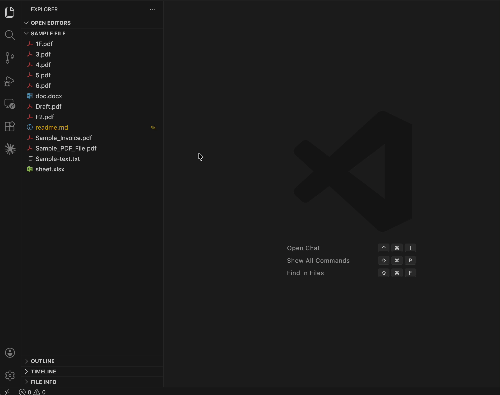

# File Info Explorer

A VS Code / Cursor extension that shows **last modified dates**, **file/folder sizes**, and **sticky notes** directly in the Explorer sidebar — on every file and folder, inline.



---

## Features

- **Modified date** shown to the right of every file and folder name in the Explorer
- **File/folder size** in hover tooltips — files show their size; folders show their total recursive size (B, KB, MB, GB)
- **Hover tooltip** with full date/time and size details (and note if set)
- **Sticky notes** — attach a short note to any file or folder; shows as a `✎` badge and appears in the tooltip
- **Three tooltip styles** — compact, detailed, or card layout
- **Relative and full modified times** — see how long ago a file changed plus the exact timestamp
- **Optional metadata** — type, created time, line count, Git status, TODO/FIXME count, JSON/Markdown stats, hashes, permissions, and more
- **File Info panel** — a dedicated panel in the Explorer sidebar listing all files with dates and notes
- Works in **VS Code**, **Cursor**, and **Antigravity**

---

## Installation

### From GitHub Releases (recommended for teams)

1. Go to the [Releases page](../../releases) and download the latest `.vsix` file
2. In VS Code / Cursor: open the Command Palette (`Cmd+Shift+P`) → **Extensions: Install from VSIX...**
3. Select the downloaded `.vsix` file

### From source

```bash
git clone https://github.com/mmarj/file-info-explorer.git
cd file-info-explorer
npm install
npm run compile
vsce package --no-dependencies --allow-missing-repository
```

Then install the generated `.vsix` as above.

---

## Usage

### Modified dates
Dates appear automatically in the Explorer sidebar as a grayed-out description next to each file/folder name. Hover over any item for the full tooltip.

### Adding a note
- Right-click any file or folder → **Add / Edit Note**
- Or use the Command Palette: `File Info: Add / Edit Note`
- Items with notes show a `✎` badge and are highlighted in yellow

### Removing a note
- Right-click a file with a note → **Remove Note**
- Or open **Add / Edit Note** and clear the input field

---

## Settings

| Setting | Type | Default | Description |
|---|---|---|---|
| `fileInfo.showDateOnHover` | boolean | `true` | Show modified date in Explorer tooltips |
| `fileInfo.timeZoneOffset` | string | `system` | `system`, or a fixed UTC offset like `UTC+8` |
| `fileInfo.showNoteBadge` | boolean | `true` | Show `✎` badge on files with notes |
| `fileInfo.tooltipStyle` | string | `detailed` | `compact`, `detailed`, or `card` |

### Metadata toggles

Each metadata group can be enabled or disabled in Settings:

| Setting | Default | Shows |
|---|---:|---|
| `fileInfo.showFileSize` | `true` | File size |
| `fileInfo.showFolderSize` | `true` | Recursive folder size in the File Info panel |
| `fileInfo.showImageDimensions` | `true` | Image width × height |
| `fileInfo.showCsvInfo` | `true` | CSV/TSV columns and headers |
| `fileInfo.showCsvRows` | `true` | CSV/TSV row count |
| `fileInfo.showFolderCounts` | `true` | Immediate folder contents |
| `fileInfo.showFolderDetails` | `false` | Largest/newest child file in folders |
| `fileInfo.showCreatedTime` | `true` | Created time |
| `fileInfo.showAccessedTime` | `false` | Last accessed time |
| `fileInfo.showFileType` | `true` | File type and extension |
| `fileInfo.showMimeType` | `false` | MIME type |
| `fileInfo.showPermissions` | `false` | Read-only / executable hints |
| `fileInfo.showSymlinkTarget` | `true` | Symbolic link target |
| `fileInfo.showLineCount` | `true` | Text line count |
| `fileInfo.showWordCount` | `true` | Markdown word count |
| `fileInfo.showEncoding` | `false` | Basic encoding detection |
| `fileInfo.showNewline` | `false` | LF / CRLF / mixed newlines |
| `fileInfo.showHash` | `false` | Short SHA-256 hash for files up to 10 MB |
| `fileInfo.showGitStatus` | `true` | Git clean/modified/staged/untracked status |
| `fileInfo.showGitLastCommit` | `false` | Latest Git commit summary |
| `fileInfo.showGitIgnored` | `false` | Git ignored status |
| `fileInfo.showTodoCount` | `true` | TODO / FIXME count |
| `fileInfo.showPackageVersion` | `true` | `package.json` version |
| `fileInfo.showJsonInfo` | `true` | JSON validity and top-level size |
| `fileInfo.showMarkdownInfo` | `true` | Markdown heading/link/image counts |

### Tooltip styles

**compact** — denser inline metadata:
```
📄 README.md
2h ago
📅 Modified: 3/12/2026, 2:14:00 PM  ·  4.2 KB  ·  ✎ Check before merging
```

**detailed** *(default)* — labeled rows with icons:
```
📄 README.md
2h ago
📅 Modified: 3/12/2026, 2:14:00 PM
📦 Size: 4.2 KB
✎  Note: Check before merging
```

**card** — sectioned layout with dividers and headers (best for the File Info panel).

### Time zones

Use `fileInfo.timeZoneOffset` to control how modified timestamps are shown:

- `system` — use your current OS time zone
- `UTC+8`, `UTC-5`, etc. — use a fixed UTC offset

---

## Requirements

- VS Code `^1.74.0` (or Cursor / Antigravity equivalent)

---

## Author

**Mir Md Aurangajeb** — [mmarjb.wordpress.com](https://mmarjb.wordpress.com/)

## License

[MIT](LICENSE)
